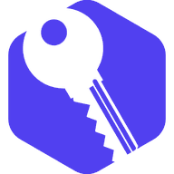

<!--
  SPDX-FileCopyrightText: 2026 Kubuno contributors
  SPDX-License-Identifier: AGPL-3.0-or-later
-->

<div align="center">



# Kubuno — Keestore

[](LICENSE)


**A zero-knowledge password and secrets manager for Kubuno — your vault is encrypted on your device with the open KDBX 4 format, and the server only ever stores an opaque blob it cannot read.**

Keestore is a module for [Kubuno](https://github.com/kubuno/core), the self-hosted, libre (AGPLv3) cloud platform — a sovereign alternative to Google Workspace and Microsoft 365. It gives every user a private, end-to-end-encrypted vault that syncs across their devices, without your master password or your secrets ever reaching the server.

</div>

---

## ✨ Features

- 🔐 **Zero-knowledge, client-side encryption** — the vault is a standard KDBX 4 (`.kdbx`) file encrypted in the browser with your master password. The server stores and syncs the encrypted blob but holds no key and can never read its contents.
- 🔁 **Cross-device sync** — one vault per user, versioned with an optimistic sync counter so an out-of-date device is told to pull the latest copy before it can overwrite it, avoiding silent conflicts.
- 🔗 **Interoperable format** — because the vault is a plain `.kdbx` file, you can download it and open it in any KDBX 4-compatible password manager, and upload an existing one to bring your entries in.
- 🩹 **Breach checking (k-anonymous)** — check whether a password has appeared in a known data breach without ever revealing it: only a 5-character prefix of its hash leaves the browser. An instance can point this at its own mirror so nothing leaves the network at all — and an administrator can disable it entirely.
- 📏 **Administrable limits** — an administrator caps the maximum uploaded vault size and controls whether breach checking is available and which endpoint it uses.
- 🧹 **Follows account lifecycle** — when the core deletes a user, their stored vault is cleaned up with them.

## 🏗️ Architecture

Like every Kubuno app, Keestore is an **independent process**, not a library linked into the core. It registers with the [core](https://github.com/kubuno/core) at startup; the core then proxies its routes (`/api/v1/keestore/*`), distributes platform events to it, serves its runtime-loaded React frontend bundle and manages its lifecycle.

- **Port** — the backend listens on `127.0.0.1:3114` and is reached only through the core's reverse proxy.
- **Backend** — `src/`: Axum + SQLx over PostgreSQL, confined to the `keestore` schema; migrations in `migrations/`. All cryptography happens in the client — the backend only stores, sizes and versions the encrypted vault and proxies the k-anonymous breach lookup.
- **Frontend** — `frontend/`: a React 19 bundle built to `entry.js` + `entry.css`, consuming `@kubuno/sdk`, `@ui` (`@kubuno/ui`) and `@kubuno/drive`. At runtime those specifiers are `external` and resolved by the host's import map to its single shared instances; the npm packages are used only for building and type-checking.
- **Trust boundary** — proxied requests are authenticated from a signed `X-Kubuno-Auth` token minted by the core (see `kubuno-modauth`), never from plain `X-Kubuno-User-*` headers.

## 📦 Install

The easiest way to self-host a full Kubuno instance (core + every module) is the **all-in-one Docker image** (`ghcr.io/kubuno/kubuno`), which already bundles this module — see **[kubuno/docker](https://github.com/kubuno/docker)** for `docker compose` instructions.

To add the module to an existing instance, install its **`.kbpkg`** — the single, cross-platform package format a Kubuno server unpacks by itself (no `.deb`/`.rpm`/`.exe`/`.pkg`, and no external tools). Each tagged release (`v*`) attaches a Linux `.kbpkg` (built by `build.yml`) and Windows/macOS `.kbpkg` files (built by `dist.yml`) to its [GitHub Release](https://github.com/kubuno/keestore/releases):

```bash
# From the admin console: Modules → Install, then drop the .kbpkg — or, offline, from the CLI:
sudo kubuno modules:install dist/keestore-<version>-<os>-<arch>.kbpkg
sudo systemctl restart kubuno     # the core loads the module on (re)start
```

## 🛠️ Build & development

**Requirements:** Rust ≥ 1.82, Node.js ≥ 24, PostgreSQL 16. No `kubuno/core` checkout is needed — shared Rust crates come from tagged git dependencies, and the `@kubuno/*` frontend libraries from the public npm scope.

```bash
cargo build --release                     # → target/release/kubuno-keestore
cd frontend && npm ci && npm run build     # → dist/{entry.js, entry.css}

bash build_kbpkg.sh                        # → dist/keestore-<version>-<os>-<arch>.kbpkg
bash build_kbpkg.sh --install              # build, install into the module store, restart
```

Once the module has been installed at least once, iterate quickly without repackaging:

```bash
bash ../_tools/deploy_local.sh keestore             # backend + frontend
bash ../_tools/deploy_local.sh keestore --frontend  # frontend only (fastest)
```

## 📦 Tech stack

Rust 2021 · Axum 0.7 · Tokio · SQLx 0.8 (PostgreSQL 16, schema `keestore`) — React 19 · TypeScript · Vite · Tailwind CSS v4 · Zustand · React Query, with in-browser KDBX 4 cryptography, on the shared `@kubuno/sdk`, `@ui` and `@kubuno/drive` surfaces.

## 🤝 Contributing

Contributions are welcome. Please open an issue to discuss any significant change before submitting a pull request.

## 📄 License

[AGPL-3.0-or-later](LICENSE) © Kubuno contributors.
